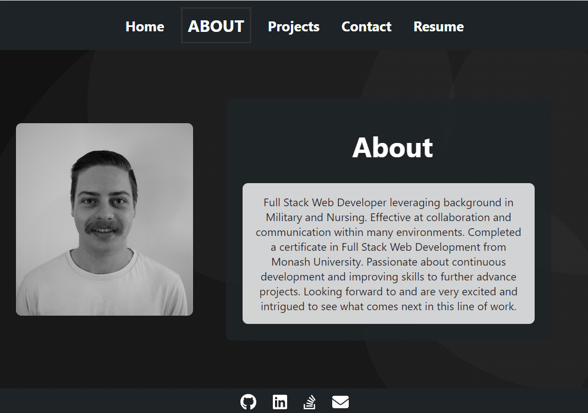
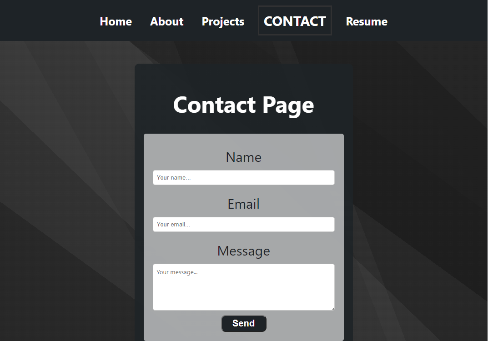

# My Portfolio 

---
## Table of Contents 
- [Description](#Description)
- [Screenshots](#Screenshots)
- [License](#License)
- [Contribution](#Contribution)
- [Questions](#Questions)
- [Links](#Links)

## Description
This project is a single-page application using React.js to dynamically render content to create a portfolio that includes "About me", "Contact me", "Resume", and "Portfolio" pages.

This portfolio was created to display my work and web applications. Heres hoping it impresses a potential employer to see whether or not I am a good match for their company.

## Screenshots

Homepage

- 

About Page

- 

Projects Page

- 

Contact

- 

Resume Page

- 

Responsive view of projects

- 

## License 

 This application is covered under the:

- [MIT-License](https://opensource.org/licenses/MIT)

## Contribution 

 None.

## Questions 

 To reach me with additional questions please contact me via one of the following methods: 

- GitHub: [GitHub](https://github.com/seanscott95)
- Email: [Email](mailto:seanms418@gmail.com)
- LinkedIn: [LinkedIn](https://www.linkedin.com/in/sean-scott-18ba07225/)

## Links
- GitHub: [GitHub](https://github.com/seanscott95/My-Portfolio)
- Deployed: [Deployed](https://seanscott95.github.io/My-Portfolio/)